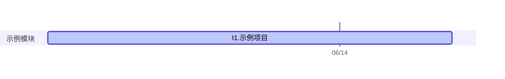

# Test?

**Keywords**：...



## To-dos

```dataviewjs
await dv.view("99 Templates/Views/Project Todos");
```

## Project Files

```dataviewjs
await dv.view("99 Templates/Views/Project Research Tree");
```

## Meetings

```dataviewjs
await dv.view("99 Templates/Views/Project Meetings");
```
