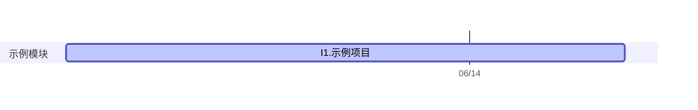

<%*
const projectFolder = tp.file.folder(true);
const docsFolder = `${projectFolder}/Docs`;
const assetsFolder = `${projectFolder}/assets`;
const ideasFolder = `${projectFolder}/Ideas`;
const ideasIndex = `${ideasFolder}/Ideas.md`;
const questionsFolder = `${projectFolder}/Research Questions`;
const questionsIndex = `${questionsFolder}/Research Questions.md`;
const experimentsFolder = `${projectFolder}/Experiments`;
const experimentsIndex = `${experimentsFolder}/Experiments.md`;
const proposalPath = `${docsFolder}/Proposal.md`;

if (!(await app.vault.adapter.exists(assetsFolder))) {
  await app.vault.createFolder(assetsFolder);
}

if (!(await app.vault.adapter.exists(docsFolder))) {
  await app.vault.createFolder(docsFolder);
}

if (!(await app.vault.adapter.exists(proposalPath))) {
  const proposalTemplate = await app.vault.adapter.read("99 Templates/Proposal.md");
  await app.vault.create(proposalPath, proposalTemplate);
}

if (!(await app.vault.adapter.exists(ideasFolder))) {
  await app.vault.createFolder(ideasFolder);
}

if (!(await app.vault.adapter.exists(ideasIndex))) {
  const sectionTemplate = await app.vault.adapter.read("99 Templates/Project Section.md");
  await app.vault.create(ideasIndex, sectionTemplate);
}

if (!(await app.vault.adapter.exists(questionsFolder))) {
  await app.vault.createFolder(questionsFolder);
}

if (!(await app.vault.adapter.exists(questionsIndex))) {
  const sectionTemplate = await app.vault.adapter.read("99 Templates/Project Section.md");
  await app.vault.create(questionsIndex, sectionTemplate);
}

if (!(await app.vault.adapter.exists(experimentsFolder))) {
  await app.vault.createFolder(experimentsFolder);
}

if (!(await app.vault.adapter.exists(experimentsIndex))) {
  const sectionTemplate = await app.vault.adapter.read("99 Templates/Project Section.md");
  await app.vault.create(experimentsIndex, sectionTemplate);
}
-%>
# <% tp.file.title %>

**Keywords**：...



## To-dos

```dataviewjs
await dv.view("99 Templates/Views/Project Todos");
```

```dataviewjs
await dv.view("99 Templates/Views/Project Research Tree");
```

## Meetings

```dataviewjs
await dv.view("99 Templates/Views/Project Meetings");
```
